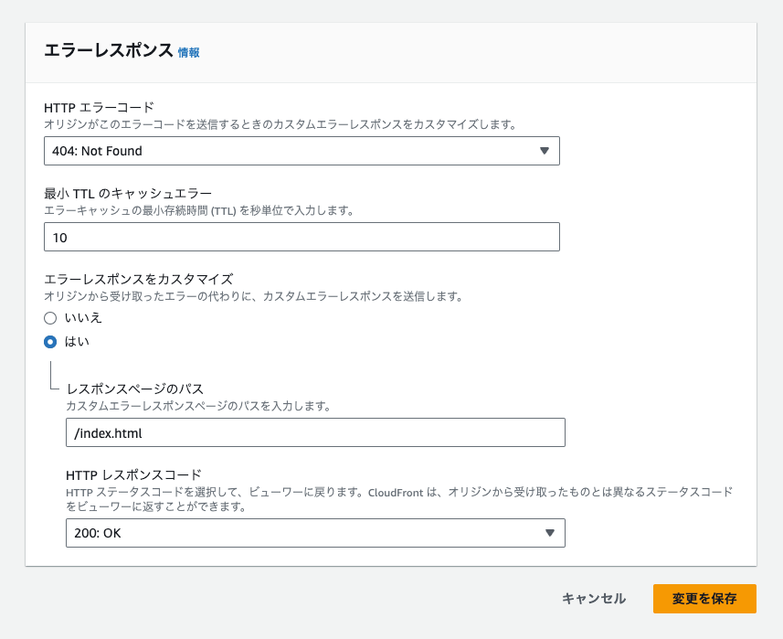

# VueRouterメモ

## 画面リロードすると404エラーになる問題
理由：  
SPAで作っているため、各エンドポイントに実態がない。

解決方法：  
cloudfrontの場合は、エラーページから「カスタムレスポンスの作成」を押し、添付画像のように設定する。  



## AWSでS3のサブディレクトリにデプロイする場合
基本ルートディレクトリむけの設定になっているため、
- router/index.ts
- vite.config.js

を修正する必要がある。
加えてindex.htmlをささないとアクセスできない場合もあるためその対応も考える。

それぞれこんな感じ  

### router/index.ts
```typescript
const router = createRouter({
  history: createWebHistory(import.meta.env.BASE_URL),
  routes: [
    {
      path: '/',
      redirect: '/index.html'
    },
    // index.htmlを含めたURLにアクセスできるようにするための追加
    {
      path: '/index.html',
      name: 'index',
      component: indexView
    }
  ]
})
```

### vite.config.js
```javascript
export default defineConfig({
  plugins: [
    vue(),
  ],
  resolve: {
    alias: {
      '@': fileURLToPath(new URL('./src', import.meta.url))
    }
  },
  base: 'ここにサブディレクトリのパス指定'
})
```